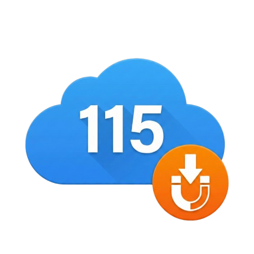

<p align="right">
  <a href="README.md">🇨🇳 中文</a>
</p>

<h1 align="center">
  <br>
  115 Offline Helper
</h1>

<p align="center">
  <strong>Detect magnet/ed2k links and push them to your 115.com cloud offline download with one click.</strong>
</p>

<p align="center">
  
  
  
</p>

---

## ✨ Features

- 🔍 **Auto-detect links** — Detect magnet and ed2k links on any web page (opt-in)
- 📋 **Clipboard support** — Paste links directly in the popup to push
- 📥 **One-click push** — Push links to 115.com offline download queue instantly
- 📁 **Custom save directory** — Choose which 115 folder to save downloads to
- 🗑️ **Auto-delete small files** — Remove files under a specified size (e.g., ads)
- 📂 **Auto-organize videos** — Move video files into folders based on filename
- 📱 **QR code login** — Log into 115.com directly from the extension popup
- 🌐 **Bilingual UI** — Supports both Chinese and English

## 📦 Installation

### Chrome Web Store (Recommended)

Install directly from the Chrome Web Store:

[](https://chromewebstore.google.com/detail/115-offline-helper/blgnjjjbmjgilkiimglodjdebcdaidgl?hl=zh-CN&authuser=0)

### Manual Install

1. **Download the extension**

   Go to the [Releases](https://github.com/gangz1o/115-offline-helper/releases/latest) page and download `115-offline-helper_v*.zip`, then unzip.

   Or clone the repo:

   ```bash
   git clone https://github.com/gangz1o/115-offline-helper.git
   ```

2. **Open Extensions page**

   | Browser | URL |
   |---------|-----|
   | Chrome | `chrome://extensions/` |
   | Edge | `edge://extensions/` |

3. **Enable Developer Mode**

   Toggle the **Developer mode** switch — bottom-left on Edge, top-right on Chrome.

4. **Load the extension**

   Click **Load unpacked** and select the `extension` folder from the project.

5. **Done!**

   The extension icon will appear in your toolbar. Pin it for easy access.

> **💡 Tip:** To update, run `git pull` and click the ↻ refresh button on the extension card.

> **💡 Compatibility:** This extension is built on Manifest V3 and works with all Chromium-based browsers (Chrome, Edge, Brave, Arc, etc.).

## 🚀 Usage

1. **Login** — Click the extension icon → **Scan to Login** → scan QR code with the 115 mobile app.
2. **Set save directory** — Choose a folder from the dropdown on the Home tab, or add custom paths in Settings (`FolderName:CID` format).
3. **Push links** — Two ways:
   - **Popup**: Paste magnet/ed2k links into the input box and click **Push**.
   - **Auto-detect**: Enable "Auto detect links" in Settings to detect links on any webpage with a one-click confirmation dialog.

### Settings

| Setting | Description |
|---------|-------------|
| Save directory list | Add folders in `Name:CID` format, one per line |
| Auto-detect links | Detect links on all pages via content script |
| Auto-delete small files | Remove files smaller than specified MB |
| Auto-organize videos | Move video files into named folders |

## ❓ FAQ

**Q: How to find a folder's CID?**
> Open the folder in [115.com](https://115.com), look at the URL: `https://115.com/?cid=1234567` — the number after `cid=` is the CID.

**Q: "Not logged in" error?**
> Click extension icon → **Scan to Login**, scan with 115 mobile app.

**Q: Auto-detect not working?**
> Enable "Auto detect links" in Settings. The browser will ask for additional permissions — click Allow.

## 🔒 Privacy

- All data is stored locally via `chrome.storage.local`
- No user data is collected, transmitted, or shared with third parties
- Only communicates with `*.115.com` domains
- [Full Privacy Policy](https://gangz1o.github.io/115-offline-helper/privacy-policy.html)

## 📄 License

[MIT License](LICENSE)
